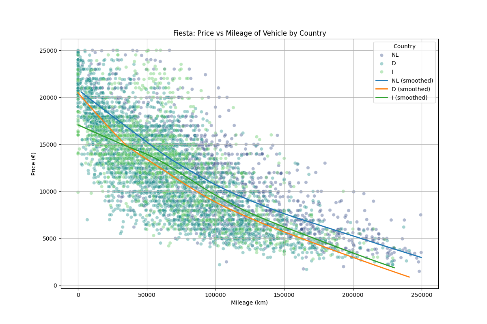
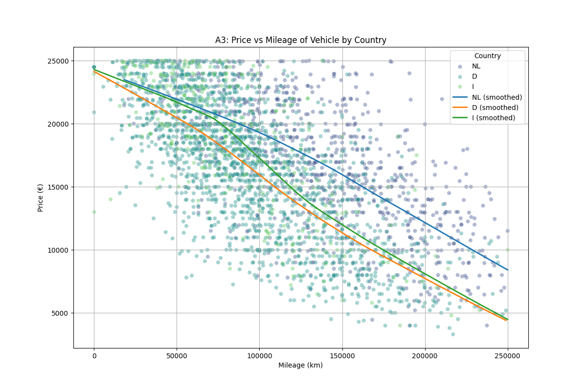

# Autoscout 24 Crawler and analysis

This project is a simple crawler for the autoscout24 website. It crawls up to 400 cars per brand/model/year combination and stores the data in a versioned directory as parquet. The data is then analyzed and visualized using some simple plots in [my workbench](workbench.py). Note I use vscode for this so it's not a fancy notebook. Feel free to crawl yourself and visualise your own data. Below is an example, more can be found in [the images folder](images/)




## Overview

This is your new Kedro project with Kedro-Viz setup, which was generated using `kedro 0.19.5`.

Take a look at the [Kedro documentation](https://docs.kedro.org) to get started.

## Getting Started

1. Clone the repository:
    ```bash
    git clone https://github.com/pascalwhoop/as24_crawl.git
    ```

2. Navigate to the project directory:
    ```bash
    cd as24_crawl
    ```

3. Install the dependencies:
    ```bash
    pip install -r requirements.txt
    ```

4. Run the project:
    ```bash
    kedro run
    ```

